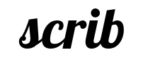

  
  
<strong>scrib</strong> Convenient Reading, Better Understanding

### The Objective

Essentially, the end goal of scrib is to provide the user a tool that allows them to read a pdf, leave bookmarks where they would like to, and leave the door open to try an approach to reading based off of Mortimor Adler's book [_How to Read a Book_](https://en.wikipedia.org/wiki/How_to_Read_a_Book).

The new approach consisting of three parts:

1. Identifying the pieces that make up the text (the structure).
2. Making a list of posssible central question (the topic) that the author was trying to answer.
3. Providing an answer (the thesis) to the chosen central question by documenting evidence that exists in the text. 
